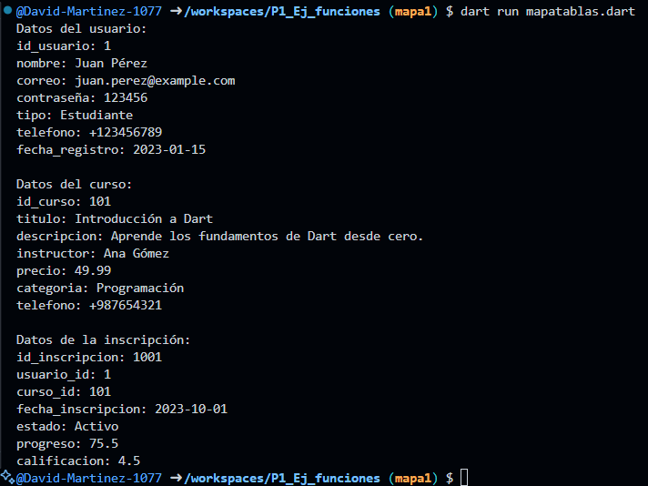

Mostrar las tres tabla de mi negocio con su respectivo forEach

usuarios: id_usuario, nombre, correo, contraseña. tipo, telefono, fecha_registro

cursos: id_curso, titulo, descripcion, instructor. precio, categoria, telefono

inscripciones: id_inscripcion, usuario_id, curso_id, fecha_incripcion, estado, progreso, calificacion

